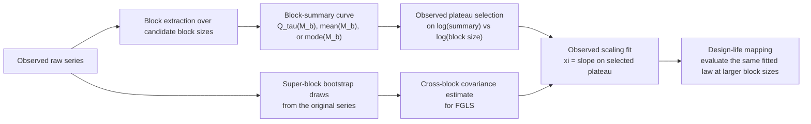
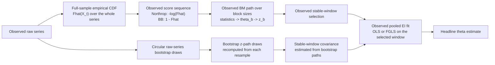

# Concepts

## EVI and EI workflows

### EVI workflow

The core EVI path is:

1. Choose a block extraction scheme and summary target.
2. Build a log block-summary curve across a candidate block-size grid.
3. Select a plateau window on the log-log scale.
4. Fit a regression slope on the selected window to estimate `xi`.
5. Map the fitted scaling law to design-life levels.

In this package, the design-life-level step is not a separate annual-maxima
fit. UniBM reuses the same block-quantile scaling law and simply evaluates it
at larger block sizes that correspond to longer design-life spans. The fitting
view therefore lives on the `block size` axis, while the planning-horizon
interpretation lives on the `design-life years` axis through the chosen
observation clock.

The relevant term for the current package output is a `design-life level`:
a quantile of the maximum over a design-life span, or equivalently a
`T`-year block-maximum `tau`-quantile on the chosen observation clock.
The current package default is `tau = 0.5`, so the headline exported curve is best read as a
**median design-life level** rather than as a classical return-period level.
The severity workflow also exports companion design-life levels at
`tau = 0.90, 0.95, 0.99`. Those higher curves reuse the same headline plateau
and slope `xi` and only shift the intercept, so they should be read as
shared-`xi` upper design-life quantiles rather than as separate headline EVI
fits.

Main entrypoints:

- `unibm.evi.generate_block_sizes`
- `unibm.evi.blocks.block_summary_curve`
- `unibm.evi.estimation.estimate_target_scaling`
- `unibm.estimate_evi_quantile`
- `unibm.estimate_design_life_level`

### EI workflow

1. Prepare block-size paths from the raw series.
2. Construct native block-maxima EI paths across the candidate block sizes.
3. Pool one preferred stable-window estimator, for example the `BB-sliding-FGLS` path.
4. Compare against reference estimators such as `K-gaps`.

The important separation is that the observed path and the bootstrap paths play
different roles:

- the **observed path** is what gets pooled and turned into the headline
  `theta` estimate
- the **bootstrap paths** are not averaged into a replacement path; they are
  used only to estimate the cross-block covariance for the FGLS weighting step

Main entrypoints:

- `unibm.ei.preparation.prepare_ei_bundle`
- `unibm.ei.selection.select_stable_path_window`
- `unibm.ei.bm.estimate_pooled_bm_ei`
- `unibm.ei.threshold.estimate_k_gaps`
- `unibm.ei.threshold.estimate_ferro_segers`

## Interpreting EVI vs EI outputs

The EVI plateau and the EI stable window answer different questions and need
not coincide.

- The EVI plateau is the block-size region where the log block-summary curve is
  sufficiently linear to support a stable `xi` estimate.
- The EI stable window is the block-size region where the extremal-index path
  is sufficiently stable to support a formal `theta` estimate.

Different block-maximum quantiles `Q_tau(M_b)` are expected to share the same
asymptotic slope `xi` and to differ mainly in intercept. In the direct
block-maxima framework used here, serial dependence is already internalized in
the fitted block-maximum law, so the design-life-level curve should be read
directly from the dependent-series fit rather than through a second BM-side
`theta` adjustment. In the current package workflow, this is implemented
explicitly by treating `tau = 0.50` as the headline fit and deriving the
`0.90 / 0.95 / 0.99` curves by holding the same plateau and slope fixed while
re-estimating only tau-specific intercepts.

In practice:

- use the EVI/design-life-level outputs for severity on the original physical
  scale
- use the EI outputs for persistence, clustering, and recovery burden
