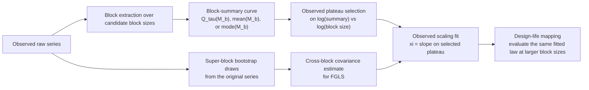
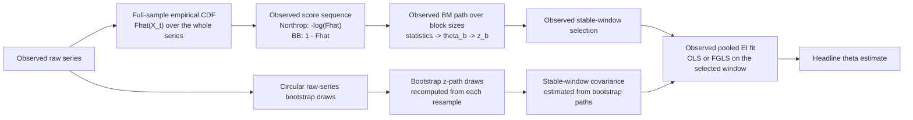

# Concepts

## EVI and EI workflows

The workflows share a default lower bound but use different upper bounds:

```text
b_min = max(5, ceil(n**(1/3)))
b_max_EVI = min(floor(n**(1 - 1/e)), floor(n/17))
b_max_EI  = min(floor(sqrt(n)), floor(n/17))
```

Here `e` is Euler's number, so the lower exponent is approximately 0.3333 and
the EVI upper exponent `1 - 1/e` is approximately 0.6321; EI uses 0.5. Each
workflow uses the length of its own input series. These are tuning defaults,
not an optimality guarantee.
The EVI grid helper's `min_disjoint_blocks` defaults to 17; an explicit `None`
omits that cap. This setting only controls the automatic upper bound, so an
explicit `max_block_size` is honored unchanged. EI uses the same `n/17` cap
alongside its square-root bound.
Neither bound is expanded to create more points. The grid is geometrically spaced,
rounded to integers, and deduplicated; callers can supply explicit block sizes.
The selectors search all usable levels in that range, including its endpoints;
there is no additional edge exclusion. The selected fitting window may be a
subset and need not include either endpoint. By default, EVI requires at least
five positive-summary levels and EI at least four finite path levels per window.
Restrict the search through the block-size bounds or an explicit `block_sizes`
grid.

Explicit bounds must be integer sizes from 2 through `N`, with the upper bound
strictly greater than the lower bound; conflicting bounds raise `ValueError`.
Infeasible automatic bounds also raise `ValueError`. A feasible grid may still
have too few usable levels for an estimator, which raises at window selection.
Use one grid source: generation controls, an explicit `block_sizes` grid, or a
reused EVI `curve`. Combining these sources raises `ValueError`.

### EVI workflow

The core EVI path is:

1. Choose a block extraction scheme and summary target.
2. Build a log block-summary curve across a candidate block-size grid.
3. Select a plateau window on the log-log scale.
4. Fit a regression slope on the selected window to estimate `xi`.
5. Map the fitted scaling law to design-life levels.


```mermaid
flowchart LR
    raw["Observed raw series"] --> blocks["Block extraction over candidate block sizes"]
    blocks --> summaries["Block-summary curve<br/>Q_tau(M_b), mean(M_b), or mode(M_b)"]
    summaries --> plateau["Observed plateau selection<br/>on log(summary) vs log(block size)"]
    raw --> bootstrap["Super-block bootstrap draws<br/>from the original series"]
    bootstrap --> covariance["Cross-block covariance estimate<br/>for FGLS"]
    plateau --> fit["Observed scaling fit<br/>xi = slope on selected plateau"]
    covariance --> fit
    fit --> design["Design-life mapping<br/>evaluate the same fitted law at larger block sizes"]
```

In this package, the design-life-level step is not a separate annual-maxima
fit. UniBM reuses the same block-quantile scaling law and simply evaluates it
at larger block sizes that correspond to longer design-life spans. The fitting
view therefore lives on the `block size` axis, while the planning-horizon
interpretation lives on the `design-life years` axis through the chosen
observation clock.

The relevant term for the current package output is a `design-life level`:
a quantile of the maximum over a design-life span, or equivalently a
`T`-year block-maximum `tau`-quantile on the chosen observation clock.
The quantile estimator defaults to `tau = 0.5`, so its curve is best read as a
**median design-life level** rather than as a classical return-period level.

The package maps **one fitted quantile** to design-life levels.
`estimate_design_life_level` cannot change that fit's `tau`: a different
quantile requires a matching fit. Separately, the repository's application
workflow exports companion levels at `tau = 0.90, 0.95, 0.99`. That workflow
holds the median fit's plateau and slope fixed and estimates a new intercept
for each quantile. These are shared-`xi` application views, not additional
fits automatically produced by the public design-life helper.

Main entrypoints:

- `unibm.evi.generate_block_sizes`
- `unibm.evi.blocks.block_summary_curve`
- `unibm.evi.estimation.estimate_target_scaling`
- `unibm.estimate_evi_quantile`
- `unibm.estimate_design_life_level`

### EI workflow

`prepare_ei_bundle` prepares all four BM paths by default. Supply `path_keys`
to compute only the required `(base_path, sliding)` pairs, or `path_keys=()` for
threshold-only estimation without any BM grid or path computation. An explicit
single `block_sizes=[b]` fixes native inference at that level and bypasses window
selection; it has `stable_window=None` and cannot be passed to pooled inference.

1. Prepare block-size paths from the raw series.
2. Construct native block-maxima EI paths across the candidate block sizes.
3. Pool one preferred stable-window estimator, for example the `BB-sliding-FGLS` path.
4. Compare against reference estimators such as `K-gaps`.


```mermaid
flowchart LR
    raw["Observed raw series"] --> cdf["Full-sample empirical CDF<br/>Fhat(X_t) over the whole series"]
    cdf --> scores["Observed score sequence<br/>Northrop: -log(Fhat)<br/>BB: 1 - Fhat"]
    scores --> path["Observed BM path over block sizes<br/>statistics -> theta_b -> z_b"]
    path --> stable["Observed stable-window selection"]
    stable --> pooled["Observed pooled EI fit<br/>OLS or FGLS on the selected window"]
    pooled --> theta["Headline theta estimate"]
    raw --> bootraw["Circular raw-series bootstrap draws"]
    bootraw --> bootpath["Bootstrap z-path draws<br/>recomputed from each resample"]
    bootpath --> bootcov["Stable-window covariance<br/>estimated from bootstrap paths"]
    bootcov --> pooled
```

The important separation is that the observed path and the bootstrap paths play
different roles:

- the **observed path** is what gets pooled and turned into the headline
  `theta` estimate
- the **bootstrap paths** are not averaged into a replacement path; they are
  used only to estimate the cross-block covariance for the FGLS weighting step

Main entrypoints:

- `unibm.ei.preparation.prepare_ei_bundle`
- `unibm.ei.bootstrap.bootstrap_bm_ei_path`
- `unibm.ei.selection.select_stable_path_window`
- `unibm.ei.bm.estimate_pooled_bm_ei`
- `unibm.ei.threshold.estimate_k_gaps`
- `unibm.ei.threshold.estimate_ferro_segers`

## Interpreting EVI vs EI outputs

The EVI plateau and the EI stable window answer different questions and need
not coincide.

- The EVI plateau is the block-size region where the log block-summary curve is
  sufficiently linear to support a stable `xi` estimate.
- The EI stable window is the block-size region where the extremal-index path
  is sufficiently stable to support a formal `theta` estimate.

Different block-maximum quantiles `Q_tau(M_b)` are expected to share the same
asymptotic slope `xi` and to differ mainly in intercept. In the direct
block-maxima framework used here, serial dependence is already internalized in
the fitted block-maximum law, so the design-life-level curve should be read
directly from the dependent-series fit rather than through a second BM-side
`theta` adjustment. The shared-slope companion curves described above are an
application-level use of this asymptotic relationship, not a guarantee that
different finite-sample quantile fits have identical slopes.

In practice:

- use the EVI/design-life-level outputs for severity on the original physical
  scale
- use the EI outputs for extremal clustering; under the usual limiting
  interpretation, `1 / theta` is a mean number of extreme observations per
  cluster, not elapsed cluster duration or recovery time

## Observation clock and annual maxima

The public estimators receive values, not timestamps. They cannot infer whether
one step means a calendar day, an observed day, or an active day. The caller
must establish that clock before fitting. EI preparation preserves the input
order and rejects non-finite values. `allow_zeros=True` preserves observed zeros;
`False` requires strictly positive input. Neither setting fills missing days.
Dropping a missing day can shorten an inter-exceedance gap, so it is not a
neutral EI preprocessing operation.

`observations_per_year` converts a design horizon into a block size; it does not
split the fitted series at January 1. The separate application GEV comparator
does form January–December annual maxima, after checking each year's coverage.
This calendar-year comparator is distinct from the many overlapping block sizes
used to estimate `xi` and `theta`.

## Bootstrap lengths, repetitions, and regularization

The EVI super-block bootstrap uses
`L = max(2 * B, floor(sqrt(N)))`, where `N` is the input series length and `B`
is the largest block size supplied to the bootstrap. The standard estimator
supplies the full positive-summary candidate grid, including levels outside
the selected fitting window. The same super-block draws are used across levels.

Both sliding and disjoint variants use this length rule without adjustment.
If `floor(N / L) < 2`, the automatic bootstrap returns no covariance; strict
FGLS raises an error, while `AUTO` may fall back to OLS. Two or three segments
retain the computed length, but do not guarantee reliable inference.
An explicit `super_block_size`
must be a non-boolean integer with `B < L <= N` and at least two complete
segments; it is used unchanged or rejected with `ValueError`. Fewer than two
usable segments cannot produce covariance. An incomplete final segment is omitted.
The factor two is a computational default, not an optimality or coverage guarantee.
EI uses its separate raw-series circular bootstrap length; this EVI rule does
not change it.

FGLS uses fixed diagonal shrinkage `0.73` for EVI and `0.37` for EI. The shrinkage
step retains marginal variances and multiplies off-diagonal covariances by
`0.27` and `0.63`, respectively, followed by a small diagonal ridge for numerical
stability. Adaptive repetitions control the
Monte Carlo error in estimating that covariance and the resulting fit; they do
not tune shrinkage, change the selected window, or create more observed data.

The default checkpoints are `128, 256, 512, 768, 1024`. A fixed integer is also
supported. See [Reading Returned Objects](reading-returned-objects.md) for the
precision targets and the meaning of a fit that reaches the cap. These are
conditional coefficient-covariance intervals, not bootstrap percentile
intervals, and the adaptive check is not a coverage guarantee.
